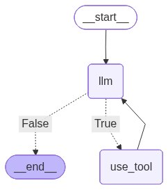

# Trabalho de  SSC0723 - Sistemas Colaborativos: Fundamentos e Aplicações
--- --
## Alunos:
* Bernardo Rodrigues Tameirão Santos - 12733212
* Lourenço de Salles Roselino - 11796805
* Samuel Figueiredo Veronez - 12542626
--- ---
## Descrição do Cenário Colaborativo

O cenário para o qual o sistema foi desenvolvido foi o de colaboração em escrita de redações. A aplicação consiste em um chat, no qual os usuários
podem discutir e colaborar na escrita de redações para uma competição, eles podem acionar uma LLM 
para acessar informações prévias da conversa, pedir ajuda e recuperar informações de fontes carregadas 
na plataforma para servir de repertório/inspiração.

Além disso, os usuários podem votar entre temas inclusos pelo administrador, enviar os próprios textos e decidir a melhor redação produzida.

O código foi baseado no código produzido em aula pelo professor Moacir Antonelli Ponti.

## Como executar o projeto

1. Clone o repositório
2. Instale as bibliotecas do arquivo `requirements.txt`
3. Execute o código com:
`python -m streamlit run colaborative_systems/src/main.py`

## Como utilizar
### Administrador:
* @add \<tema\>:
    O administrador pode definir novos temas com a diretiva @add, que podem ser votados por todos usuários. A votação permanece aberta até todos membros terem votado.
* @begin_contest:
    Inicia o concurso de redação após o tema ter sido definido, a LLM criará 5 prompts diferentes sobre o tema.

### Usuário:
* @llm \<prompt\>:
    O usuário pode pedir a opinião ou ajuda da LLM por meio desse comando,
* @entry \<texto\>:
    Envia o texto do usuário para ser votado, após todos usuários terem votado, é decidido o vencedor.

## Diagrama do Grafo

O fluxo do agente consiste majoritariamente nos nós 'llm' e 'use_tool'.

* **Nó LLM**: chama o LLM instanciado com as informações de contexto da conversa, mensagens anteriores e tema votado pelos usuários.
A LLM tem acesso às tools, e caso o estado do agente chame uma das tools, o grafo passa para o nó 'use_tool', caso contrário, encerra o fluxo,
e a última mensagem do estado do agente é inclusa no chat como mensagem do assistente.
* **Nó use_tool**:  A LLM tem acesso às tools implementadas. Caso o fluxo chegue nesse nó, pega os argumentos de chamada
da tool, decide o método da ferramenta e o executa com os parâmetros inclusos.
Após a executar a funcionalidade desse nó, o resultado das tools executadas é incluso no estado do agente, que volta ao nó LLM para ser utilizado para responder o usuário.

## Abordagem 3C

1. **Comunicação**:
    * O sistema possibilita a troca de mensagens entre diversos usuários em tempo real e permite que uma LLM seja acionada para
auxiliar a dar ideias, consultar documentos, recapitular e opinar sobre mensagens e textos prévios.

2. **Colaboração**:
    * A colaboração é facilitada através do chat, que permite que os usuários compartilhem e contribuam entre si, discutindo ideias e dados.
    * A LLM possibilita discutir o tema, assim como adicionar fontes e pedir ajuda para integrar as informações ao texto de maneira coerente e coesa.
    * Usuários podem votar para decidir o próximo tema de redação e votar nas redações publicadas. 

3. **Coordenação**:
    * O usuário Administrador pode decidir temas de redação para serem votados pelos membros, assim como iniciar o concurso.

## Limitações

Devido ao número de tokens diários disponibilizados pelo groq, adicionamos algumas restrições no funcionamento da aplicação, as principais são:
* Tamanho do histórico de mensagens enviadas como contexto para a LLM.
* Número máximo de resultados na busca por
embeddings.
* Número máximo de retries na chamada da LLM.